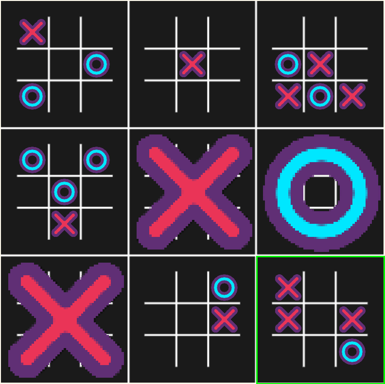

# Super XO ❌ 🔵

Super XO is a python-based version of the [Ultimate Tic-Tac-Toe](https://en.wikipedia.org/wiki/Ultimate_tic-tac-toe) game.

In this project you can play agains yourself, a local friend, a online friend or even agains an AI that choses random moves.

<p align="center">
  
</p>

---

## 🚀 Installation

Clone the repository and install the dependencies:

```bash
git clone https://github.com/FranciscoN17/Super_XO.git
cd Super_XO
pip install -r requirements.txt
````

> 💡 Make sure you are using **Python 3.8+**

---

##  Usage

### Local Multiplayer (2 Players – Same Machine)

```bash
python3 main.py
```

---

### 🌐 Online Multiplayer (2 Players)

#### 1️. Start the server

```bash
python3 server.py
```

#### 2. Player 1 joins

```bash
python3 client.py
```

#### 3. Player 2 joins

```bash
python3 client.py
```

---

### 🤖 Single Player (Vs AI)

#### 1. Start the server

```bash
python3 server.py
```

#### 2. Player joins

```bash
python3 client.py
```

#### 3. Start the AI opponent

```bash
python3 ai.py
```

---

## 📁 Project Structure

```text
In progres...
```

---

## 📜 License

This project is licensed under the **MIT License**.
See the [LICENSE](LICENSE) file for more details.
